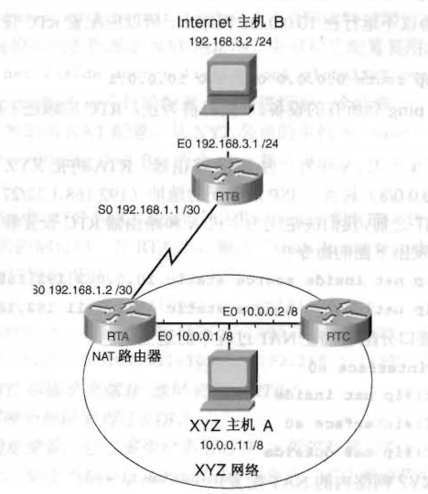

# 计算机网络第二次大作业


## 1. 概述
实现lab2的第二份实验手册pdf中的第二个实验（NAT配置）的半自动化配置工具。
其中网络拓扑图如下图所示。



其中，所有的接口连线不可修改，但是所有ip地址可以修改，
只需满足RTA的f0/0、RTC的f0/0与主机A在同一个内网下，RTB与主机B在外网即可。


## 2. 前置操作
前置操作是为了能够用telnet连接路由器而进行的必要操作。
1. 按照实验拓扑图连接路由器和交换机，其中RTA、RTC与Host A之间采用交换机连接。
2. 将RTB的f0/1口连接到交换机上。
3. 将服务器连接到交换机上。
4. 将3个路由器的控制口分别连接到3台配置用电脑上，开启超级终端，重启所有路由器。
5. 配置RTA的f0/0、RTB的f0/1、RTC的f0/0口和服务器的ip到同一个网段下。
6. 分别配置Host A和Host B的ip、掩码和缺省网关。
7. 用以下命令配置路由器的vty和enable配置。
```
Router(config)#line vty 0 4
Router(config-if)#password CISCO
Router(config-if)#login
Router(config-if)#exit
Router(config)#enable password en CISCO
Router(config)#enable secret CISCO
Router(config)#login
Router(config)#exit
```
